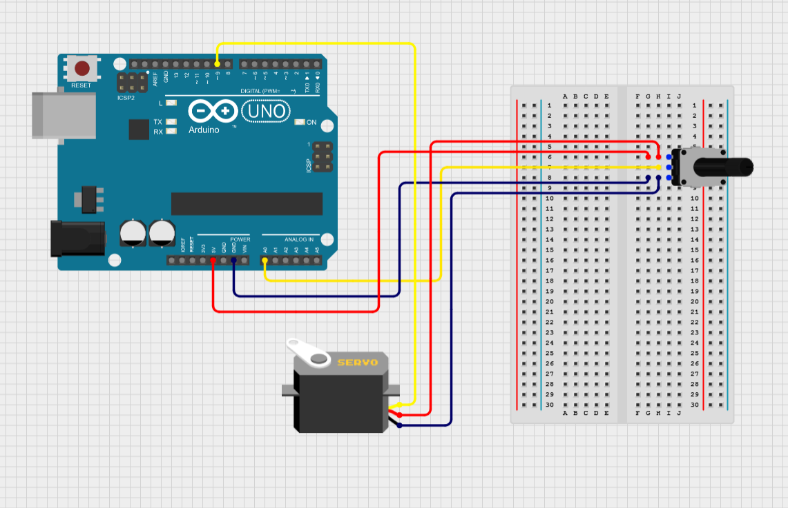

# 01 - Controlling Servo Motor with Potentiometer

## Experiment Description
This experiment aims to explore the Servo Motors capabilities and restrictions, learning how the device works and how it can be paired with a potentiometer to add a level of control. This experiments aim is to successfully loop through every position the Servo Motor can be in, and then controlling its position to match the potentiometers rotation.

## Components
### 1x Servo Motor (SG90)
The servo motor is a motor which can change its position based on input, with the ability to rotate clockwise and anti-clockwise based on controller or sensor inputs, but only a certain amount of degrees as some motors have a mechanical obstacle at either 180/360 degrees. It works off of a PWM signal and a position feedback signal, comparing the two values resulting in an error signal. This error signal is then processed by a controller, resulting in the motor turning.

### 1x Rotary Potentiometer
A rotary potentiometer is used to control voltage output via a rotatable knob, acting as an adjustable resistor which controls how much current is being output. The way that the resistance is adjusted is via a wiper placed on a resistance track with a uniform resistance, the system acts as a potential divider circuit which changes the voltage based on the resistance between the wiper and its position.

## Walkthrough (Record of Troubleshooting and Success)
Before working with the Servo Motor, implementing the appropriate library was required to work with the component. Implementing the Servo.h library, and then creating a Servo object allows me to work with a Servo Motor in my IDE.
```C
#include <Servo.h>

Servo myservo;  // create Servo object to control a servo
```

After creating the Servo object, a Pulse Width Modulation (PWM) pin connection would be needed to write a specific voltage to the motor so it is connected to pin 9.

```C
void setup() {
  Serial.begin(9600);
  myservo.attach(9);  // attaches the servo on pin 9 to the Servo object
}
```

After attaching the motor to the correct pin and GND, the motor was ready to be written to. These for loops were setup to loop through each position of the servo motor, turning 180 degrees clockwise and then anti-clockwise.

```C
for(int i = 0; i <= 180; i++){
    myservo.write(i);
    delay(15);
}
    for(int i = 180; i >= 0; i--){
    myservo.write(i);
delay(15);
}
```

### Evidence: [See SERVO-01.MOV]

After testing this solution, the motor successfully rotated clockwise and anti-clockwise. Although, there were significant delays between the clockwise and anti-clockwise loops. I decided to proceed with implementing the potentiometer so I could use it to manually change the value and see if that made any difference to the solution.

```C
int sensorReading = analogRead(A0);

int position = map(sensorReading, 0, 1023, 0, 180);

Serial.println(position);
```

After connecting a potentiometer component to the solution, I coded a map which read the potentiometer value and converted it into a suitable value for the servo motor. With serial messages for debugging the position value.

```C
if(pos < position) {
    pos++;
} else if (pos > position) {
    pos--;
}
myservo.write(pos);
```

To match the potentiometer value to the servo motor position, if statements were checked through each iteration to see whether the position of the position of the motor was greater or smaller than the potentiometer value, and incrementing/decrementing it accordingly. This was successful!

### Evidence: [See SERVO-02.MOV]

Although, the motor would only turn at a certain potentiometer value. The values 0-90 were the only values which would change the position of the motor. After attempting to change the map value to different ranges to get a complete 180 degree rotation, the motor would not rotate a full 180 degrees.

After changing the range to 0 to 90 degrees the motor was able to rotate at every position of the potentiometer rotation. Meaning that the motor could only turn 90 degrees.

### Evidence: [See SERVO-03.MOV]

## Circuit Diagrams



## Evaluation
The servo motor I used was capable of looping through a series of positions to rotate both clockwise and anti-clockwise, and through the use of a potentiometer I was able to manipulate its position based on my own manual input, controlling the rotation of the servo motor using a series of if statements and the voltage taken from the potentiometer.

The most tricky part of successfully completing this solution was attempting to rotate the motor a full 180 degrees. According to research into the specific motor type and similar motors to it, its common that servo motors can rotate up to either 180 degrees to 360 degrees depending on the model. I was only able to rotate the device to 90 degrees successfully.

I had to experiment the different values to iterate through, which while made easier with the potentiometer and the ability to manually see where the servo motor moved and didn't move, still proved difficult in diagnosing the correct rotational values the motor was able to take.

Based on research some individuals found it possible to adjust the maximum rotational value that the motor could turn, with some even taking apart the component and adjusting it on a hardware level. In future, this could be useful to look into if ever working with servo motors again, although I would have to consider attempting to change the rotational limits on a software level rather than taking the component apart and risking causing damage. 

## References
https://jawhersebai.com/tutorials/how-to-use-the-sg90-servo-motor/

https://www.electrical4u.com/potentiometer/