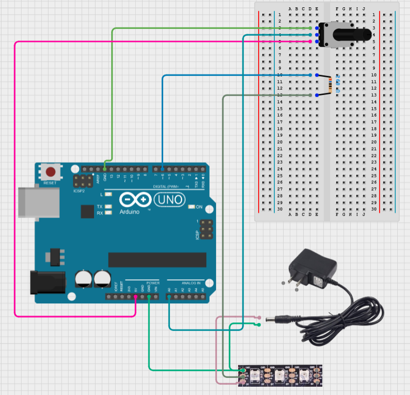

# 02 - Creating an LED strip light solution

## Experiment Description
This experiment aims to test out the functionality of the Adafruit Neopixel LED Strip Light, gaining an understanding of how the component works and what it can be used for. The final concept of this experiment should involve an LED strip light which can fully light up, and the should be presented by changing each individual LED on the strip light.

## Components

### 1x Adafruit Neopixel LED Strip Light
An LED strip light is an array of individual LED lights spaced evenly apart across a strip, each light being able to produce Red, Green, Blue and in some cases White values, with variations depending on the model. Each individual LED can be controlled using the Din pin which receives control signals, this can control each individual LED light on the strip through the use of the components' library.

### 1x Rotary Potentiometer

## Walkthrough (Record of Troubleshooting and Success)
This experiment utilises the NeoPixel library from Adafruit.
```C
#include <Adafruit_NeoPixel.h>
#ifdef __AVR__
 #include <avr/power.h> // Required for 16 MHz Adafruit Trinket
#endif
```

After importing the library the component needed some details specified in the code in order to control every LED light on the strip light.

The component requires a specified pin to send signals and data to the LED strip light, pin 6 was used as it was a PWM pin allowing me to analogWrite to the component. It also required me to specify how many pixels were on the light which I had to find out through trial and error.

```C
// Which pin on the Arduino is connected to the NeoPixels?
#define PIN 6 // On Trinket or Gemma, suggest changing this to 1
// How many NeoPixels are attached to the Arduino?
#define NUMPIXELS 50 // Popular NeoPixel ring size
```

After specifying these details in the code, the final step to setup the device was to create the object in which to communicate with the component. This object is initialised with the amount of pixels, the pin used, the LED colour type, and the communication speed which is 800kHz.

```C
Adafruit_NeoPixel pixels(NUMPIXELS, PIN, NEO_RGB + NEO_KHZ800);
```

Now in the setup function, I was able to begin using the component.

```C
void setup() {
  // These lines are specifically to support the Adafruit Trinket 5V 16 MHz.
  // Any other board, you can remove this part (but no harm leaving it):
  pixels.begin(); // INITIALIZE NeoPixel strip object (REQUIRED)
}
```

Now that the solution had been setup ready for use, I was able to use a for loop to iterate through the LED strip light and enable each individual pixel with a set colour. Clearing them at each iteration and re-enabling each pixel.

```C
void loop() {
  pixels.clear(); // Set all pixel colors to 'off'

  // The first NeoPixel in a strand is #0, second is 1, all the way up

  for(int i = 0; i <= NUMPIXELS; i++){
    pixels.setPixelColor(i, pixels.Color(255,0,0));
    pixels.show();
    delay(500);
  }

}
```

I encountered an issue with the solution where every pixel was not the corresponding colour I expected them to be, instead of all being green the lights were changing with each pixel enabled.

Additionally, the LED strip would only enable a certain selection of pixels.

### Evidence: [See LED-01.MOV]

One of my peers pointed out that the LED strip light was not limited to just RGB values as previously specified in the object initalisation, the LED used RGBW values.

```C
Adafruit_NeoPixel pixels(NUMPIXELS, PIN, NEO_GRBW + NEO_KHZ800);
```

After changing the colour type to NEO_GRBW, and after trial and erroring through changing the NUMPIXELS value, we found the component had 198 pixels. Then the solution began to produce the colours according to what was specified in the code across the whole component, all green! Iterating through each pixel and setting the colour to green and then enabling it.

### Evidence: [See LED-02.MOV]

To expand on this experiment I decided to hook up a potentiometer to turn this solution into a speedometer. Controlling the speed at which the strip light would light up, and change the colour depending on the speed.

After connecting the potentiometer to pin A0, I was able to create a map which converted the potentiometers values to an acceptable value for LED lights (0, 1023 to 0, 255).

### Evidence: [See LED-03.MOV]

After implementing this solution, I was able to apply these values to the pixels colour. When the potentiometer value was low the colour would turn red, when the potentiometer value was high the colour would turn green. Combining these two maps would allow me to make a blend of green to red depending on the value of the potentiometer.

```C
    int redval = map(sensorValue, 0, 1023, 255, 0);
    int greenval = map(sensorValue, 0, 1023, 0, 255);

    pixels.setPixelColor(i, pixels.Color(redval,greenval,0));
```

To finish this experiment, I also mapped the potentiometer value to the delay value, creating a delay value which when increased would reduce the delay of the for loop.

```C
for(int i = 0; i <= NUMPIXELS; i++){
    int sensorValue = analogRead(A0);

    int redval = map(sensorValue, 0, 1023, 255, 0);
    int greenval = map(sensorValue, 0, 1023, 0, 255);
    int delayval = map(sensorValue, 0, 1023, 40, 0);

    pixels.setPixelColor(i, pixels.Color(redval,greenval,0));
    pixels.show();
    delay(delayval);    
}
```

The final product worked successfully, presenting the speed of which the for loop was enabling LED lights, with a visual representation of colour. Demonstrating the components ability to change colours and iterate through each individual pixel.

### Evidence: [See LED-04.MOV]

## Circuit Diagrams


Diagram may differ from actual solution, refer to this instead if need be:

### Alternative: [See LED-05.png]

## Evaluation
The LED strip light can be used for various different applications, using an array of individual LED lights across a strip can provide many visual combinations and uses by iterating through each one and assigning a RGBW colour. With Adafruits Neopixel library it was easy to communicate different information to the component and create visual patterns.

Setting up the component to produce the correct LED light information posed a challenge, I was confused as my lack of research into the model itself presented me with the issue of using the wrong colour type. Instead of using RGBW which includes red,green,blue,and white values I was using simply RGB, which produced confusing results. After reviewing the code and gaining feedback from my peers I was able to resolve the very small issue.

In addition to this, I spent a lot of time iterating and attempting to find out how many pixels were on the LED strip light. I believe I could have cut the time working on this down by researching more into the specific model used rather than having to repeatedly iterate different code variations to reach the correct result.

The use of this LED strip light will benefit my final project as I could use it as the "tennis court", by changing up this solution to only output one LED light at a time and clearing the rest I could immitate a tennis ball. With the strip light acting as a court with two ends which players could hit the ball from.

## References
https://arduinogetstarted.com/tutorials/arduino-neopixel-led-strip