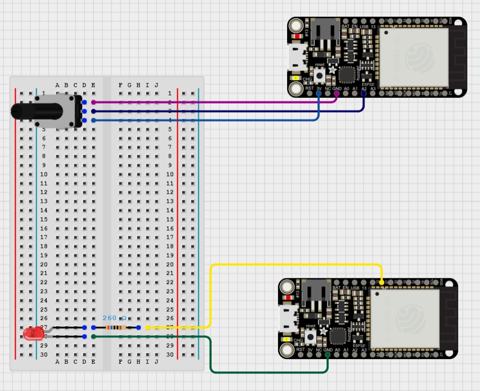

# 04 - Controlling LED with Potentiometer & ESP32

## Experiment Description
After successfully sending and receiving data between two Feather boards via ESP-NOW, this experiment will utilise more components including an LED light to test the interaction between two components across two different feather boards. The desired end result being an LED light being controlled by a potentiometer via ESP-NOW.

## Components
### 2x Adafruit HUZZAH32 - ESP32 Feather

### 1x Rotary Potentiometer

### 1x LED (Two Pin)
An LED light with two pins works by connecting GND to the Cathode (shorter pin) and LCC to the Anode (longer pin). The voltage input is used to control the brightness of the LED, so if the LED is fed 5V it will be fully lit, the brightness of the LED can be adjusted using the voltage, but most LEDs (including the one used here) a resistor is needed to prevent LEDs from burning out due to voltage spikes.

### 1x Resistor (260V)
Resistors are used to provide resistance to electrical currents. It is used to prevent voltage spikes by converting electrical currents into heat. The greater the resistance the stronger the barrier against the current. Colour codes on resistors are used to define the amount of resistance and tolerance a resistor has.

## Walkthrough (Record of Troubleshooting and Success)
Expanding upon the ESP32 Sending/Receiving experiment, I am able to utilise the previous solution as a template for this experiment.

Since LEDs were being worked with, the data being sent had to be changed, an analogue value is used to determine the brightness of the LED to which an integer would be used. The value should be between 0 and 255 to determine the LEDs brightness.


And so the message struct was adjusted to include an unsigned 16-bit number instead of a string.
```C
typedef struct struct_message {
    uint16_t val; // A 16-bit unsigned number
} message_t;
```

In addition to this, given a potentiometer is being used to determine the brightness it was required that the value read from the potentiometer had to be converted into a suitable value for the LED.

```C
int sensorValue = analogRead(A2);
int brightness = map(sensorValue, 0, 4095, 0, 255);
```
Here the analogue value is read from the potentiometer connected to pin A2. The value is then converted into a value compatible with the LED via a map.

It was expected that the potentiometer would return a value between 0 and 1023, but it was returning a value between 0 and 4095. This was only discovered after being advised to change the value. After researching the issue, I found that the Feather boards have a different ADC resolution to the Arduino board previously used.

### Evidence: [See LED-PO-01.MOV]

After uploading to both feather boards the solution was still only partially working. The potentiometer value was being converted and sent to the receiver from the transmitter, but the LED light was not lighting up with no indication as to why. Whilst recording the failed attempt we found that the LED light pins were the wrong way round to which flipping them instantly resolved the issue and completed the experiment.

### Evidence: [See LED-PO-02.MOV]

## Circuit Diagrams



## Evaluation
Upon further experimentation with the ESP32 Feather boards I have expanded on what sort of data can be sent wirelessly between two devices. By implementing more components into the solution I have been able to send dynamic values which can be used to power/change other components.

Although, challenges were encountered when trying to combine the feather devices with components, specifically the potentiometer. One of the issues I encountered was the difference in the read value, the Analogue Digital Converters (ADC) resolution was not something I considered when creating the solution and put a pause on my progress.

Additionally, I came to a point at the end of the experiment where I had to search for an issue not immediately obvious. A small mistake in placing the pins for the LED incorrectly caused confusion, but gave me an opportunity to break down my solution into steps to find out what part of the solution was causing the issue.

Being able to communicate different data types between two feather boards via other components will be useful in my final project, as the solution relies on player movement I will need to implement a component to read movement values and communicate them to the central device.

## References
https://www.espressif.com/en/solutions/low-power-solutions/esp-now

https://www.electrical4u.com/potentiometer/

https://docs.arduino.cc/language-reference/en/functions/analog-io/analogReadResolution/

