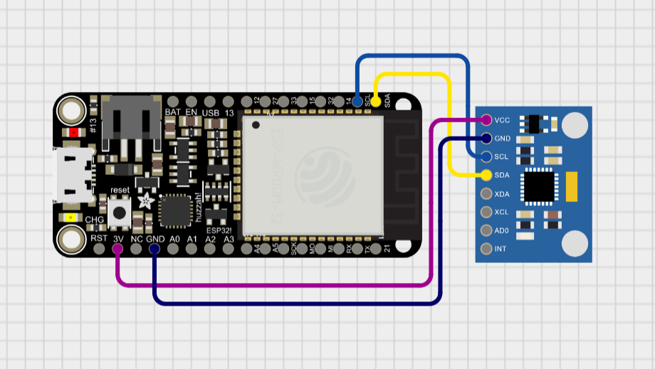

# 05 - Reading Data from an Accelerometer

## Experiment Description
This experiment aims to explore the data that can be read from an Accelerometer, including accelerometer and gyroscope data. To read all the data being read from the device and outputting it, understanding what data is given and how it could be utilised in the future.

## Components
### 1x Adafruit HUZZAH32 - ESP32 Feather

### 1x MPU6050 Accelerometer and Gyroscope Module
The MPU6050 is known as a Micro-Electronic-Mechanical System (MEMS). This system provides accelerometer data and gyroscope data through a 3-axis Accelerometer and 3-axis Gyroscope. With a DMP the device can make its own calculations without putting stress on the micro controller its connected to.

MEMS systems such as the MPU6050 are made up of a suspended piece of mass which utilises inertial force. Sensing displacement detects changes in movement which is then translated into electrical signals.

## Walkthrough (Record of Troubleshooting and Success)
To start this experiment, I had to import the required libraries for the accelerometer. Given that I was using feather boards to send this data from one board to the central point board I was able to take my previous code sample of a transmitter feather board and use it here to test the accelerometer.

### Evidence: [See ACC-01.jpg]

After configuring the board according to the circuit diagram. I was able to use a piece of example code from the MPU6050 library which provided sufficient code for reading and outputting all data available from the device.

```C
#include "Wire.h"
#include <MPU6050_light.h>
```

This line of code creates an object from the MPU6050 class which will allow me to control the device and read data from it.
```C
MPU6050 mpu(Wire);
```

Wire references the I2C communication interface which allows the MPU6050 to communicate with the feather boards micro controller to send data from the device to the feather board.

(The I2C communication interface is a protocol used to allow devices such as sensors to communicate to micro controllers using the SDA which stands for Serial Data, and SCL which stands for Serial Clock.)

This communication is then started, as well as the MPU6050 itself. A while loop is used to prevent the code from running if a connection isn't established between the two devices.
```C
Wire.begin();

byte status = mpu.begin();
Serial.print(F("MPU6050 status: "));
Serial.println(status);
while(status!=0){ } // stop everything if could not connect to MPU6050
```

Following this, the device requires its offsets to be calculated before outputting data, this is done to ensure that the data being read is correct. Measuring the output while stationary to calibrate the sensors and subtract the offsets from the readings.
```C
Serial.println(F("Calculating offsets, do not move MPU6050"));
delay(1000);
mpu.calcOffsets(true,true); // gyro and accelero
Serial.println("Done!\n");
```

Once those steps were complete, the data was able to be outputted to the Serial Monitor for analysis.
```C
if(millis() - timer > 1000){ // print data every second
    Serial.print(F("TEMPERATURE: "));Serial.println(mpu.getTemp());
    Serial.print(F("ACCELERO  X: "));Serial.print(mpu.getAccX());
    Serial.print("\tY: ");Serial.print(mpu.getAccY());
    Serial.print("\tZ: ");Serial.println(mpu.getAccZ());

    Serial.print(F("GYRO      X: "));Serial.print(mpu.getGyroX());
    Serial.print("\tY: ");Serial.print(mpu.getGyroY());
    Serial.print("\tZ: ");Serial.println(mpu.getGyroZ());

    Serial.print(F("ACC ANGLE X: "));Serial.print(mpu.getAccAngleX());
    Serial.print("\tY: ");Serial.println(mpu.getAccAngleY());
    
    Serial.print(F("ANGLE     X: "));Serial.print(mpu.getAngleX());
    Serial.print("\tY: ");Serial.print(mpu.getAngleY());
    Serial.print("\tZ: ");Serial.println(mpu.getAngleZ());
    Serial.println(F("=====================================================\n"));
    timer = millis();
}
```

These readings output to the Serial Monitor once every second, allowing me to see all the data the device had to offer. An important piece of information taken from the data is the Accelerometer data.

### Evidence: [See ACC-02.jpg]

After reviewing the data I found that the accelerometer data had a flaw, the Z axis would by default be set to roughly 1.0 when stationary. I didn't understand why this was happening so I restarted the solution only to be met with the same results.

After searching the code I found that the accelerometer data being output was given as a multiple of the gravity [1g = 9.81 m/s²], meaning that the Z axis value was set to 1.0 while stationary due to gravity.

When placing the device on its side I found the 1g of gravity in the data had shifted to the corresponding axis the device was sitting.

### Evidence: [See ACC-03.MOV]

So while the data wasn't outputting what I had originally expected, the data was in fact correct.

## Circuit Diagrams


## Evaluation
Experimenting with the MPU6050 allowed me to understand what data it could output from its Accelerometer and Gyroscope, including rotation, speed of movement, speed of rotation, and even temperature. The device is simple to use and provides useful information for motion detection which I can use in my final project.

I now have a general understanding of how a sensor like the MPU6050 communicates to the micro controller on the feather board. Researching into the I2C communication interface allowed me to understand how the code is able to send the data directly to the feather board.

Although, I learnt that the acceleration data is a multiple of the gravity, which is not accounted for in the accelerometer data. This will bring challenge to its implementation into the final project. I will have to understand how to remove this extra variable in order to read more accurate data and process it later on.

The experiment was a partial success as I was able to read the data and understand what was being presented via the Serial Monitor, but the next step to completing this experiment will be to learn how to overcome this problem which I do not currently understand how to face. Further research into whether other data taken from the accelerometer could be used to calculate the devices facing direction and potentially map a value which negates the gravity factor from the data being read.
## References
https://www.geeksforgeeks.org/i2c-communication-protocol/

https://circuitdigest.com/microcontroller-projects/interfacing-mpu6050-module-with-arduino