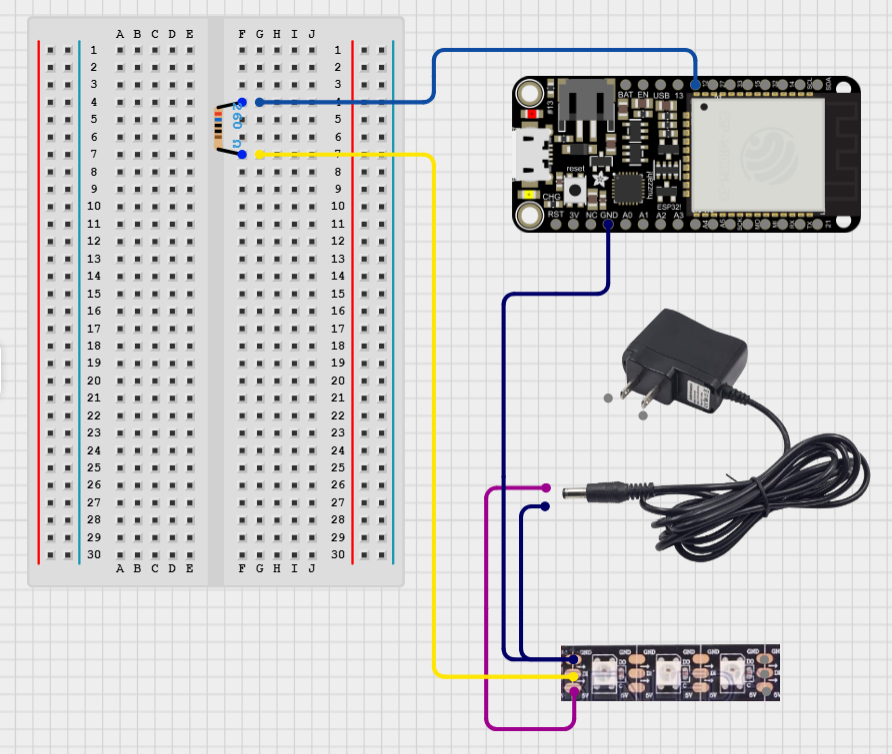

# 02 - Creating a moving tennis ball using LED strip light.

## Experiment Description
The purpose of this experiment is to utilise the Adafruit Neopixel LED strip light to replicate a tennis ball moving from one side of the strip light to the other using 1 LED light at a time. In addition to this, this experiment aims to setup the game over scenario where if the ball leaves the "court" (hits the end of the strip light on either side) the game will end and the appropriate player will win.

## Components

### 1x Adafruit HUZZAH32 - ESP32 Feather

### 1x Adafruit Neopixel LED Strip Light

## Walkthrough (Record of Troubleshooting and Success)
Following on from my previous experiment using the Adafruit Neopixel LED strip light, my first step was to implement the already working solution onto the central point feather board which handled the tennis ball and receiving data.

To visualise the concept I had in my head I decided to simply create a solution which sent a single pixel from one end of the strip light to the other.

These for loops were created to send a signal to the LED strip light which only enabled one pixel at a time. Once the last pixel in the loop had been lit the next loop would run and send the light back the other way (and vice versa).

```C
void loop() {
    for(int i = 0; i <= 143; i++){
        pixels.clear();
        pixels.setPixelColor(i, pixels.Color(0,255,0));
        pixels.show();
        delay(40);    
    }

    for(int i = 198; i >= 0; i--){
        pixels.clear();
        pixels.setPixelColor(i, pixels.Color(0,255,0));
        pixels.show();
        delay(40);    
    }
}
```

This was successful! The light started from one side of the strip and traveled to the other side of the strip light, and then returned to the start! This perfectly reflected my vision of the tennis ball traveling across the court.

### Evidence: [See BALL-01.MOV]

Now that my vision of the visual tennis ball was successful I was able to implement a system to detect when the tennis ball hit the edge of the court it would end the game with corresponding winner messages to the serial monitor.

In order to detect when the ball left the court, I had to create a variable to represent the ball called pixel. This would be used to determine whether the pixel reaches the first pixel (Pixel 0) or reaches the end pixel (Pixel 143). Additionally, a player hit variable has been created to tell the ball which direction to move, the integer represents which player hit the ball, so if player 2 hit the ball it would move towards player 1's side of the court.

```C
int pixel = 1;
int playerHit = 1;
```

Now that I am able to determine which player hit the ball, and where the ball is, I can use these variables to create a while loop which constantly moves the ball.

This while loop was created. Requirements had to be met to ensure that the game runs properly. The loop only runs when the ball is within the specified range of pixels (0 to 143), following this the pixel variable is either incremented or decremented by one depending on which player hit the ball last.

```C
while(pixel >= 0 && pixel <= 143){
    if(playerHit == 1){
        pixel++;
    } else {
        pixel--;
    }
```

Now that the ball movement has been setup to work with player input, more if statements are put in place to check whether the ball has left the court. If the pixel reaches 0 or 143 then the loop breaks and the winner is output to the Serial Monitor.

```C
    if(pixel == 0){
        Serial.print("Player 2 wins.");
        break;
    }
    if(pixel == 143) {
        Serial.print("Player 1 wins.");
        break;
    }
}
```

And the final step to demonstrating this was to show the pixel and give it a green colour. Each iteration of the while loop the code would move the ball depending on the last player who hit it, then it would check if the ball has left the court, and once all the requirement checks had passed the code would clear the pixels and display a new one in the updated position.

```C
void loop() {
    while(pixel >= 0 && pixel <= 143){
      if(playerHit == 1){
        pixel++;
      } else {
        pixel--;
      }
      if(pixel == 0){
        Serial.print("Player 2 wins.");
        break;
      }
      if(pixel == 143) {
        Serial.print("Player 1 wins.");
        break;
      }
      pixels.clear(); // Set all pixel colors to 'off'
      pixels.setPixelColor(pixel, pixels.Color(0,255,0));
      pixels.show();
      delay(20);
  }
}
```

After testing this solution, the experiment was a success! After testing both possible outcomes the winner was determined both times successfully.

### Evidence: [See BALL-02.MOV] and [See BALL-03.MOV]

## Next Step
The next step in the project now is setting up a controller to test the "swing" functionality, using the accelerometer to read movement data and convert that into a "swing" in order to change the direction in which the ball is moving.

## Circuit Diagrams


## References
https://learn.adafruit.com/adafruit-huzzah32-esp32-feather/pinouts
https://arduinogetstarted.com/tutorials/arduino-neopixel-led-strip